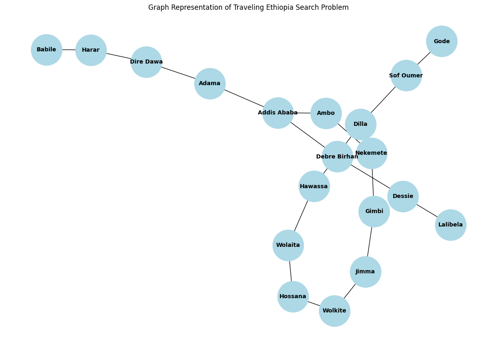
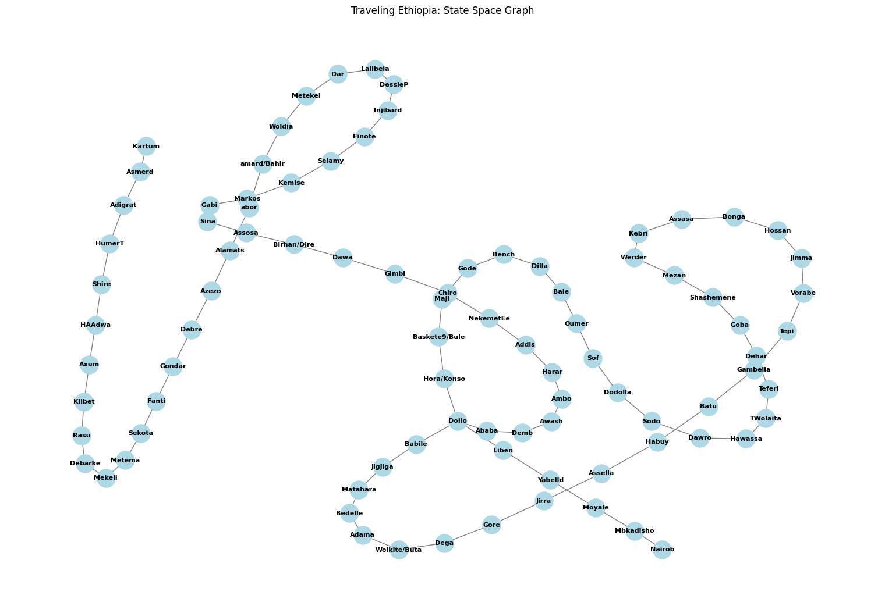
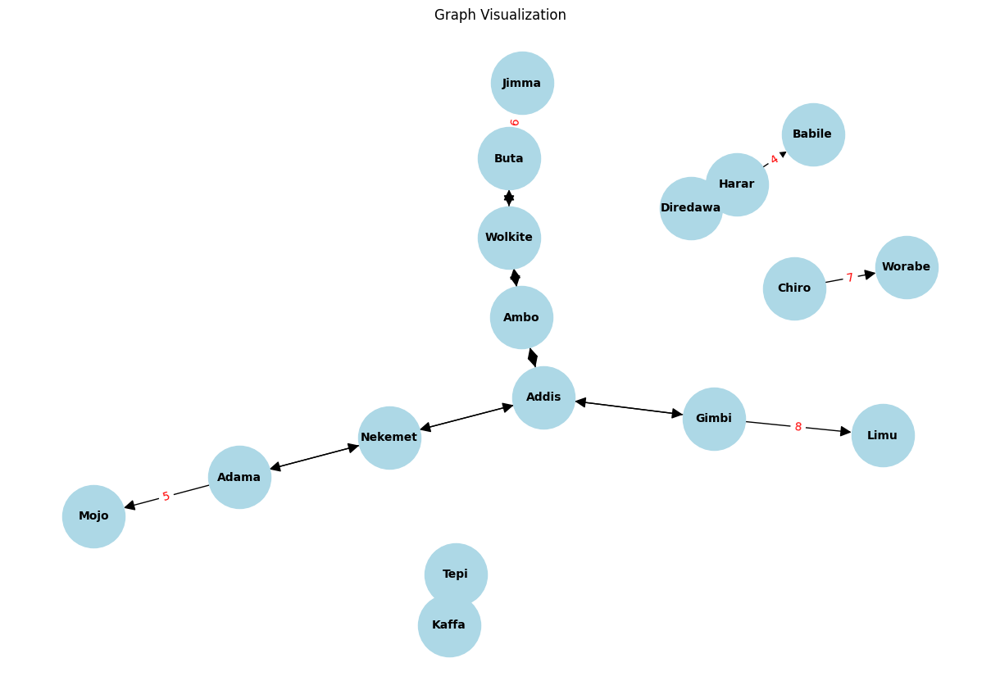
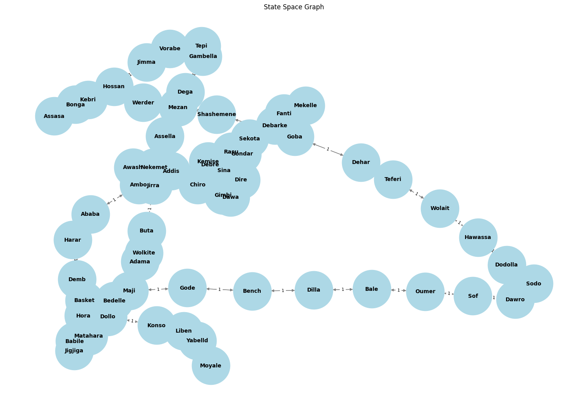
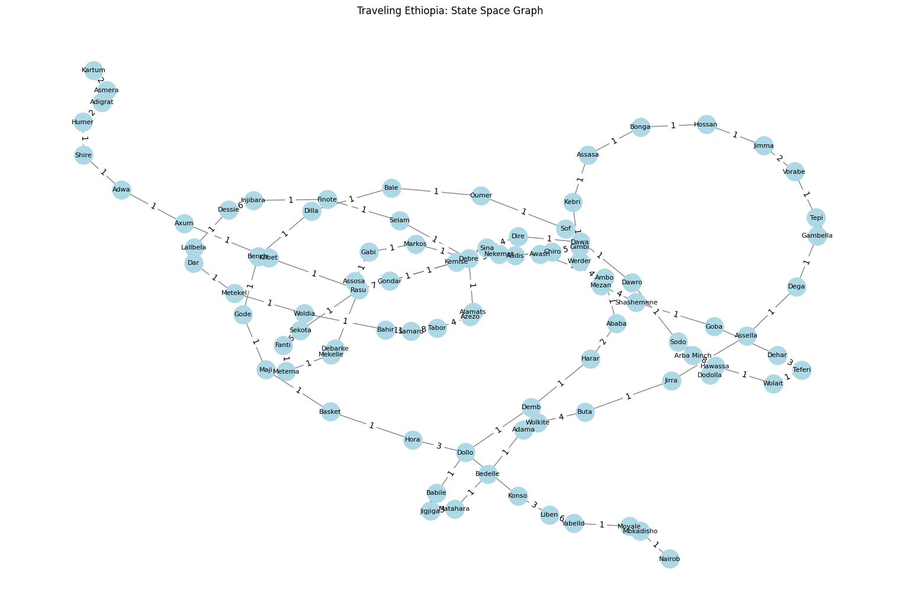
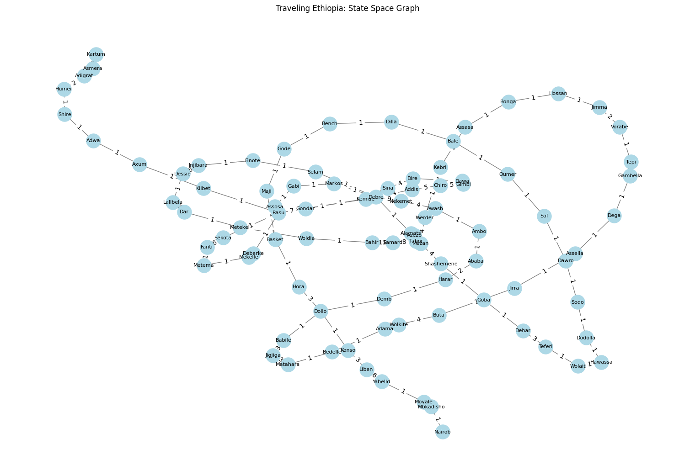

 Name Antnhe Debebe
  iD ATE/3036/14
The degree of a node represents the number of direct connections it has. Analyzing the degrees of nodes provides insights into the centrality of cities:

#  Degree Analysis
The degree of a node represents the number of direct connections it has. Analyzing the degrees of nodes provides insights into the centrality of cities:

# Degree Analysis
The degree of a node represents the number of direct connections it has. Analyzing the degrees of nodes provides insights into the centrality of cities:

High-Degree Nodes:
Addis Ababa: Degree = 3 (connected to Ambo, Adama, Debre Birhan).
Ambo: Degree = 2 (connected to Addis Ababa, Nekemete).
Adama: Degree = 2 (connected to Addis Ababa, Dire Dawa).
Low-Degree Nodes:
Lalibela: Degree = 1 (connected only to Dessie).

